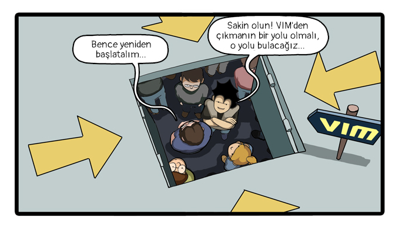

Bu repo, [@vimturkce](http://twitter.com/vimturkce) hesabında GIF olarak paylaşılan içerikleri barındırır ve **haftalık olarak güncellenir**.

Aşağıdaki listede komutları gruplarına göre yanlarına ufak açıklamalar yazarak ayırdım. GIF dosyalarını görüntülemek ve başlıkla ilgili bilgiye erişmek için bağlantıya tıklamanız yeterli.

### Başlıklar

### girdi modu
- [`<C-o>` ― girdi modu içinde tek komut için normal moda geçiş yapmak](gifs/2_ctrl-o)
- [`S`, `C` ― girdi moduna girmek](gifs/4_S-C-girdi-moduna-gecmek)
- [girdi modundan çıkarken dosyanın otomatik kaydedilmesi](gifs/28_girdi-modu-ve-dosyanin-kaydedilmesi)
- [`inoremap ( ()<ESC>i` ― otomatik parantez tamamlamak](gifs/30_parantez-tamamlama)
- [`<C-r>0` ― girdi modunda yapıştırmak](gifs/45_girdi-modunda-yapistirmak)
- [`<C-x><C-f>` ― otomatik dizin tamamlama](gifs/46_otomatik-dizin-tamamlama)

### normal mod
- [`ciw` ― imlecin üzerinde bulunan kelimeyi silmek](gifs/5_ciw-kelime-silmek)
- [`<C-k> ile diagraf (özel karakter) basmak`](gifs/6_ozel-karakter-basmak)
- [`%` ― parantez çiftlerinde atlama yapmak](gifs/7_parentiz-ciftleri-atlama)
- [`dn` ― en son aranan kelimeye kadar silmek](gifs/9_aranan-kelimeye-kadar-silme)
- [`g+`, `g-` ― undo branching](gifs/8_undo-branching)
- [`~` ― karakteri büyük/küçük harf değiştirmek](gifs/11_buyuk-kucuk-harf)
- [`ga` ― *ascii*, *hex* ve *octal* değerleri göstermek](gifs/12_ascii-hex-octal-deger)
- [`xp` ― karakterlerin yerini değiştirmek](gifs/15_xp-karakterleri-degistir)
- [`sistem komutu çalıştırmak`](gifs/17_harici-komut-calistirmak)
- [`<C-a>` `<C-x>` ― karakter/sayı artırmak](gifs/18_karakter-artirmak)
- [bölmelerin kullanımı](gifs/19_bolmelerle-coklu-dosya-acmak)
- [`ri` `ce` `le` ― metin hizalamak](gifs/21_metin-hizalamak)
- [`vimgrep /hey/ **/*` ― birden fazla dosyada arama yapar](gifs/23_coklu-dosya-deger-arama)
- [`zfa` ― açılır-kapanır kod blokları](gifs/25_acilir-kapanir-bloklar)
- [`<C-p>` ― otomatik kelime/ifade tamamlama](gifs/27_kelime-tamamlama)
- [`%s/\<a\>/b/gc` ― tam eşleşenler için bul-değiştir](gifs/34_tam-eslesme-ara-ve-degistir)
- [`%s/a/b/gc` ― etkileşimli bul-değiştir ](gifs/35_etkilesimli-bul-degistir)
- [`<C-v> g <C-a>` ― çoklu satırda sayı artırmak](gifs/36_coklu-satirda-sayi-artirmak)
- [`%s/kelime//gn` ― aranan değer için eşleşme sayısını bulmak](gifs/40_kelime-eslesme-sayisi)
- [`Q` ― çoklu komut modu (*ex*) açmak](gifs/47_ex-coklu-komut-modu)

### atlamalar (*jumps*)
- [`f`, `F` ve `t`, `T` - satıriçi aranan harfe atlama yapmak](gifs/10_satirici-aranan-harfa-atlama)
- [`gd` ― kelimenin ilk tanımlandığı konuma atlamak](gifs/26_gd-tanima-atlamak)
- [`20%` ― yüzde oranlı satır atlamak](gifs/37_yuzde-oranli-satir-atlamak)

### işaretleyiciler (*markers*)
- [işaretleyicilerin (*markers*) kullanımı](gifs/22_isaretler)
- [<code>`0</code> ― değişiklik yapılan son dosyayı açmak](gifs/50-degisiklik-yapilan-son-dosyayi-acmak)

### yazmaçlar (*registers*)
- [`"+p` ― sistem panosundan yapıştırmak](gifs/3_panodan-yapistirmak)
- [`<C-r>=` ― deyim yazmacını kullanmak](gifs/42_deyim-yazmaciyla-dort-islem)

### makrolar
- [`qa` ― makro kaydetmek](gifs/14_makro-kaydetmek)
- [`ia<ESC>qqylp<C-a>q24@q` ― tüm alfabeyi ekrana basar](gifs/20_alfabeyi-basmak)
- [`qq0yt=A<C-r>=<C-r>"<CR><Esc>j` ― dört işlem hesaplayan makro hazırlamak](gifs/43_makrolarla-dort-islem)

### komut satırı
- [`:nnoremap Q 0yt=A<C-r>=<C-r>"<CR><Esc>` ― *nnoremap* ile dört işlem hesaplayan komut yazmak](gifs/44_nnoremap-dort-islem-hesaplamak)
- [`:Ex` ― mevcut dizini görüntülemek ve yönetmek](gifs/41_dizini-goruntulemek-ve-yonetmek)
- [`:!sudo tee %` ― sudo yetkisiyle dosya kaydetmek](gifs/29_sudo-dosya-kaydetmek)
- [`:w >> b.js` ― verilen satır aralığını bir başka dosyaya yazmak](gifs/31_satir-araligini-dosyaya-yazmak)
- [`:g/^/m0` ― satırları ters çevirmek](gifs/32_dosya-satirlarini-ters-cevirmek)
- [`:sort u` ― aynı satırları silmek](gifs/33_ayni-satirlari-silmek)
- [`:g/hey/d` ― eşleşen değerin bulunduğu satırı siler](gifs/24_g-eslesen-satiri-silmek)
- [`:mksession` ― oturum dosyası oluşturmak](gifs/13_oturum_dosyasi_olusturmak)
- [`:m<satir>` ― satır taşımak](gifs/16_m-satir-tasimak)
- [`:set undofile` ― kalıcı değişiklik (undo) geçmişi](gifs/48_kalici-undo-gecmisi)

### diğer
- [uzak sunucudaki dosyayı düzenlemek](gifs/49_scp-uzak-sunucu-dosya-duzenlemek)
