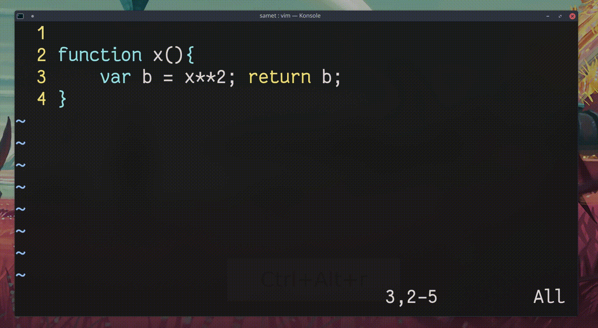

## `f<karakter>`

Bir sonraki aranan karakterin üstüne atlar.

- `f` ileri doğru karakterin üstüne atlar
- `F` geriye doğru karakterin üstüne atlar
- `t` ileri doğru karakterin yanına atlar
- `T` geriye doğru karkaterine yayına atlar

`2f<karakter>` komutuyla aranan karakter için işleşen 2. `<karakter>` değerin konumuna atlar.
