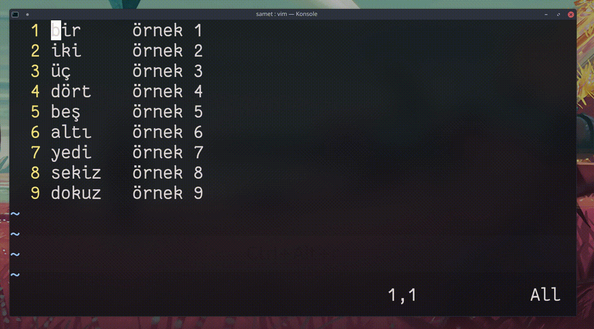

## `q<karakter>`

Belirtilen karaktere, tekrar `q`'ye basılana kadar olan hareketleri makro olarak kaydeder. Kaydedilen makroyu çalıştırmak için `@<karakter>` komutu gönderilir. Görsel modunda vim komut satırı üzerinden `:normal @<karakter>` komutuyla makrolar çoklu-satır çalıştırılabilir.
