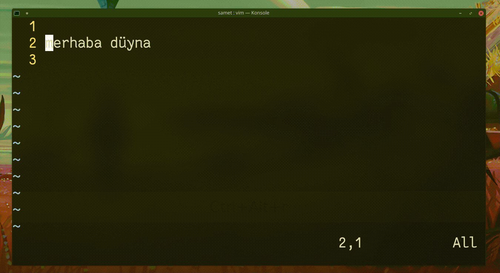

## `xp`

İmlecin üzerinde bulunduğu karakterin konumuyla bir sonraki karakterin konumunu değiştirir. `x`, imlecin üzerinde bulunduğu karakteri silerken, `p` komutu silinen veya kopyalanan son değeri imlecin bulunduğu konumun sonrasına yapıştırır.
