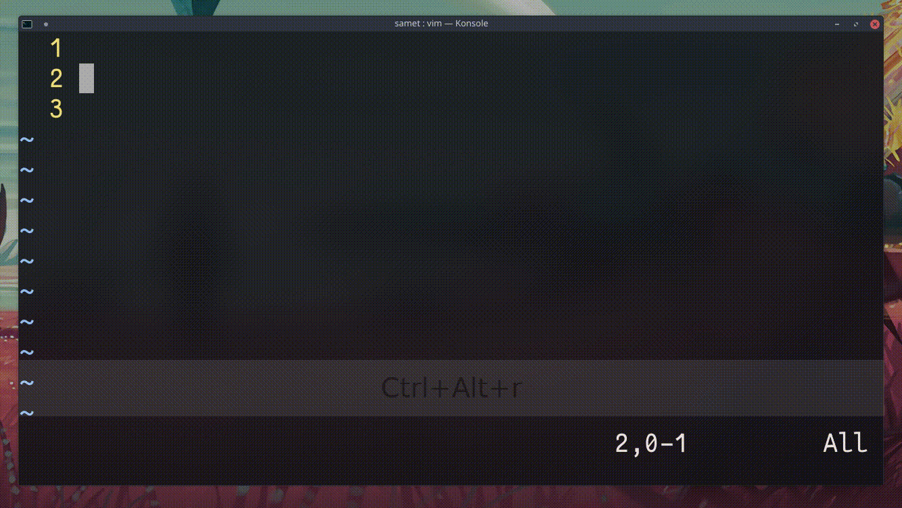

## `ia<Esc>qqylp<C-a>q24@q`

Alfabeyi ekrana basar.

- `ia<Esc>`	― a karakterini basar
- `qqylp` 	― q için makro kaydı başlatır, son karakteri kopyalayıp yapıştırır
- `<C-a>q`	― imlecin üstündeki karakteri artırır ve makro kaydını durdurur
- `24@q`	― 24 defa q için kaydedilen makroyu çalıştırır

:tada:
