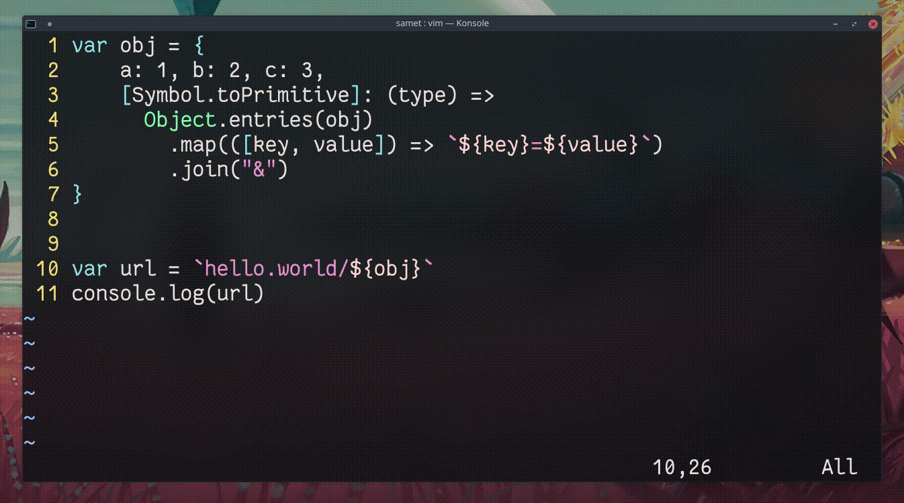

## `m<karakter>`, `'<karakter>`, `\`<karakter>`

İşaretler (marks) ile imlecin mevcut konumu kaydedilebilir ve daha sonra bu konuma atlanabilir. `m<karakter>` imlecin o anki konumunu kaydeder. `\`<karakter>` konuma, `'<karakter>` kolonu dikkate almadan yalnızca satır konumuna atlar. Büyük dosyalarda imleç hareketlerini kolaylaştırır.
