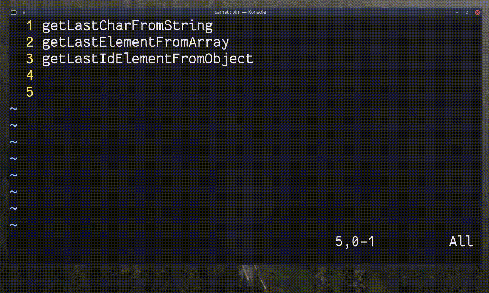

## `<C-p>`, `<C-n>`

Girdi modundayken imlecin bulunduğu konumdan satır başına kadar olan değeri mevcut dosyada arar ve bulunan değerlerle kelimeyi tamamlar. `<C-n>` dosyanın başından, `<C-p>` sonundan arayarak tamamlar.
