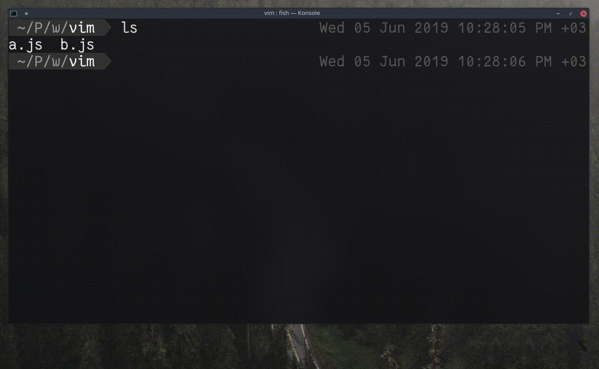

## `:[range]w >> <dosya>.js` 

Mevcut dosyada belirlenen aralıktaki satırları `<dosya>.js` dosyasının sonuna ekler. `5,15w` aralığı 5. ile 15. satır aralığını eklerken, `'<,'>w` aralığı görsel modda seçili olan satırları ekler.
