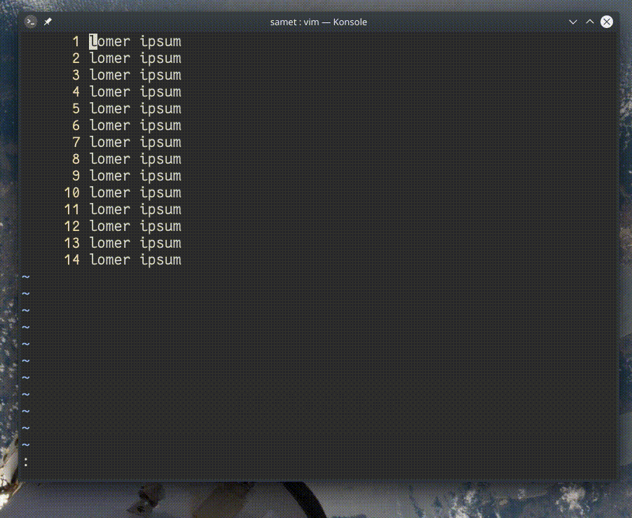

## `%s/x/y/gc`

c parametresiyle bul/değiştir işlemi interaktif modda açılır.

- y ― değiştir
- n ― eşleşmeyi atla
- l ― eşleşmeyi değiştir ve kapat
- a ― sonraki eşleşmelerin hepsini değiştir
- q ― kapat

:h :s
