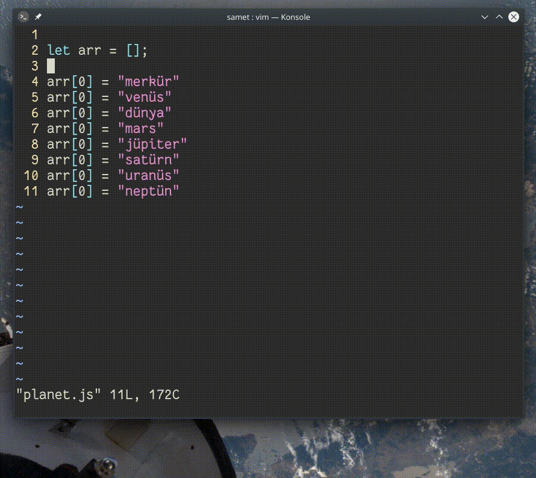

## `<C-v> g <C-a>`

`<C-v>` komutu ile *görsel blok* moduna geçiş yaptıktan sonra çoklu satırda sayıları seçebilir ve artırma işlemini `<C-a>` komutuyla verebiliriz. Sayıları azaltmak için `<C-x>` komutunu kullanabiliriz. 

