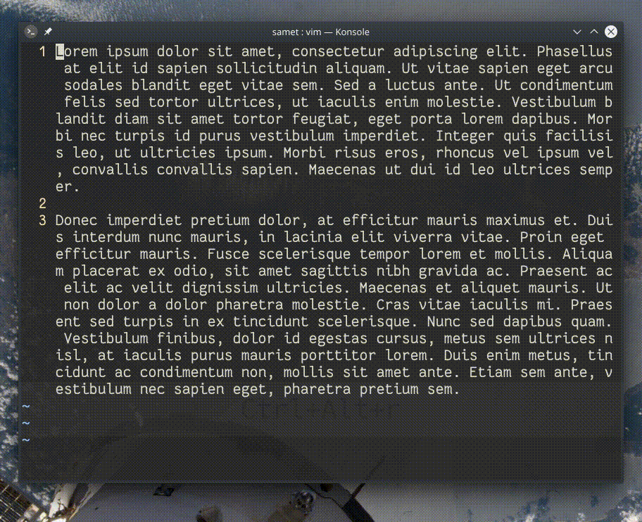

## `:%s/dolor//gn`

Dosya içindeki tüm satırlarda "dolor" kelimesini arar ve eşleşme sayısını gösterir.

**n** parametresi (bkz: `:h :s` ) tüm eşleşmeler için değiştirme işlemini pas geçer. Böylece yalnızca eşleşmelerin sayısını aldığımız bir işlem gerçekleştirmiş oluruz.

