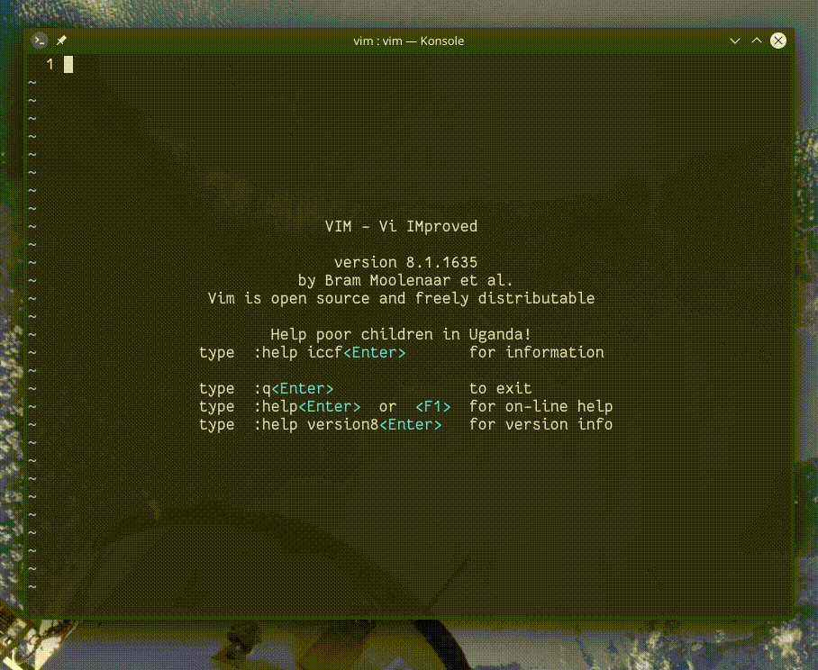

## `:Ex`, `:Lex`, `:Sex`

*netrw* eklentisi dosya ve dizinlerde gezmemizi sağlayan gömülü bir eklentidir. `:Ex` komutu ile mevcut dizini görüntüleyebiliriz.

- `D`, imlecin üstündeki dosya/dizini siler
- `R`, yeniden adlandırır
- `X`, çalıştırır
- `%`, yeni dosya/dizin yaratır

Eklentiyi farklı boyutlarda veya konumlarda açmak için aşağıdaki komutlar kullanılabilir:

- `:Lex`, eklentiyi sol bölümde açar
- `:Sex`, eklentiyi pencereyi dikey bölümleyerek açar
- `:Vex`, eklentiyi pencereyi yatay bölümleyerek açar (tek dosyada çalışıyorsanız bunun yerine `:Lex` kullanabilirsiniz)
- `:Tex`, eklentiyi yeni sekmede açar

`:h netrw`
