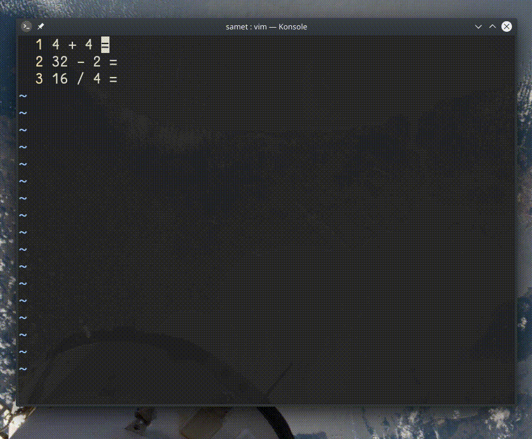

## `<C-r>=`

Girdi modundayken deyim yazmacıyla (`"=`) basit hesaplamalar yapmamızı sağlar.
Komut satırında açılan `=` değeri, bizden bir deyim beklemektedir. Bu satırda `<C-r>"` komutunu vermek, satıra son kopyalanan değeri yapıştırır.
