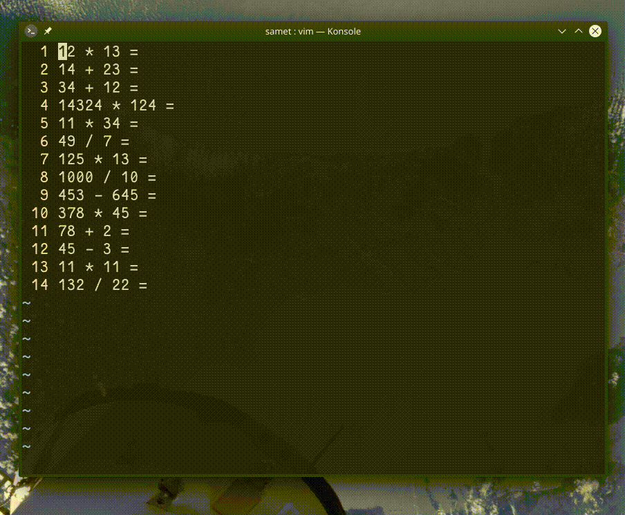

## `qq0yt=A<C-r>=<C-r>"<CR><Esc>j`

Bu komut, satırda bulunan matematiksel ifadeyi kopyalayarak deyim yazmacını kullanır ve ifadeyi hesaplar.

- `qq` ― `q` değeri için makro kaydını başlatır
- `0yt=A` ― satır başına atlayarak sonraki `=` karakterin yanına kadar kopyalar ve satır sonunda girdi modunu açar
- `<C-r>=` ― `Ctrl+R` kombiyasyonunu göndererek deyim yazmacı için komut satırı açar
- `<C-r>"` ― Kopyalanan son değeri (matematiksel değer) komut satırına yapıştırır
- `<CR><ESC>j` ― Enter ve ardından ESC tuşlarına basarak bir alt satıra iner
