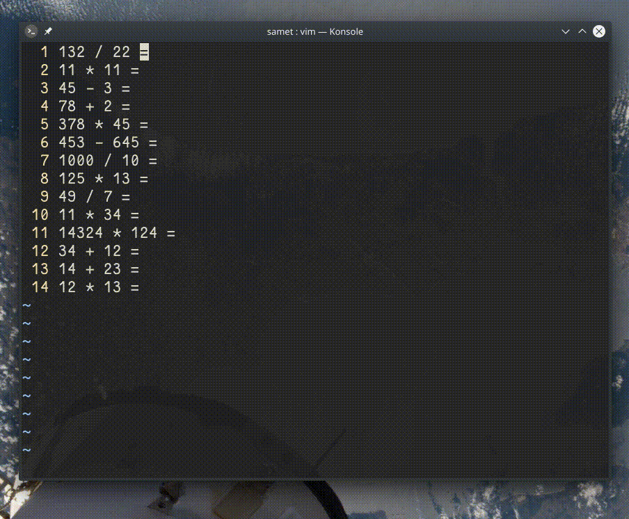

## `:nnoremap Q 0yt=A<C-r>=<C-r>"<CR><Esc>`

Komut satırından verilen bu komut, normal modda Q değeri için, imlecin bulunduğu satırdaki matematiksel ifadeyi hesaplayarak sonucu eşittir karakterinden sonraki konuma yapıştırır.

- `nnoremap Q` ― Q karakterine verilen komutu atar 
- `0yt=A` ― satır başına atlayarak sonraki `=` karakterin yanına kadar kopyalar ve satır sonunda girdi modunu açar
- `<C-r>=` ― `Ctrl+R` kombiyasyonunu göndererek deyim yazmacı için komut satırı açar
- `<C-r>"` ― Kopyalanan son değeri (matematiksel değer) komut satırına yapıştırır
- `<CR><ESC>j` ― Enter ve ardından ESC tuşlarına basarak bir alt satıra iner
