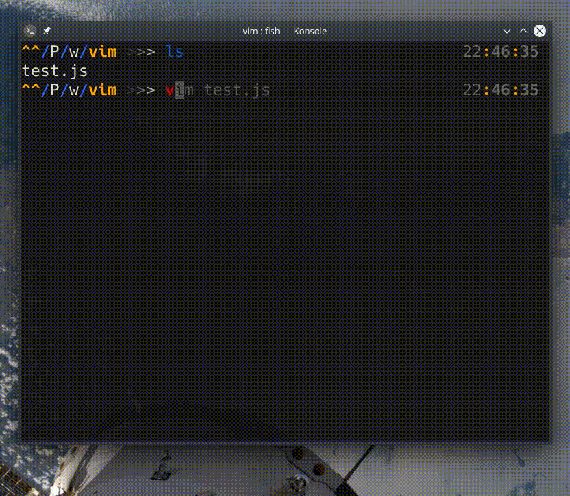

## `:set undofile`

Undo geçmişini tutar. Standart olarak oturum sonlandığında değişiklik geçmişi de silinir fakat bu komutla değişiklikleri kalıcı olarak tutabiliriz.

_.vimrc_ dosyasına `set undodir=~/.vim/<dizin-adi>` komutu girilerek değişikliklerin hangi dizin altında tutulacağı belirtilebilir.

`:help undo`
