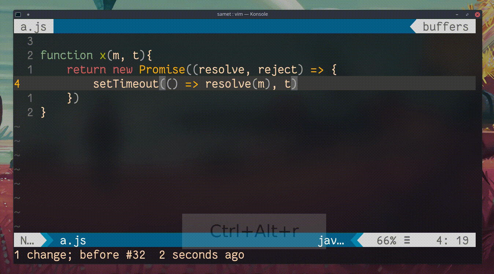

## `S`, `C`

Normal moddayken
- `S` komutu imlecin bulunduğun satırın tamamını silerek girdi moduna geçiş yapar, satırbaşı boşluklarını dikkate alır
- `C` komutu imlecin bulunduğu konumdan satır sonuna kadar silerek girdi moduna geçiş yapar
