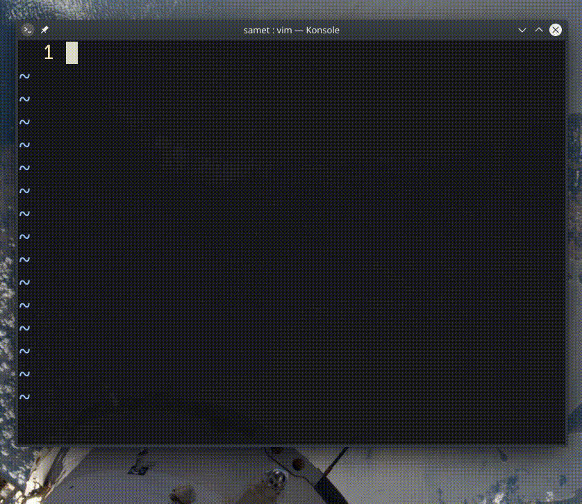

## `i1<ESC>qqYp<C-a>q8@q`

- `i1<ESC>` ― imlecin bulunduğu konuma `1` yazar
- `qqYp` ― `q` için makro kaydı başlatır ve imleç satırını alt satıra kopyalar
- `<C-a>q` ― imlecin üzerindeki sayıyı bir artırır ve makro kaydını durdurur
- `8@q` ― `q` makrosunu 8 defa tekrarlar
