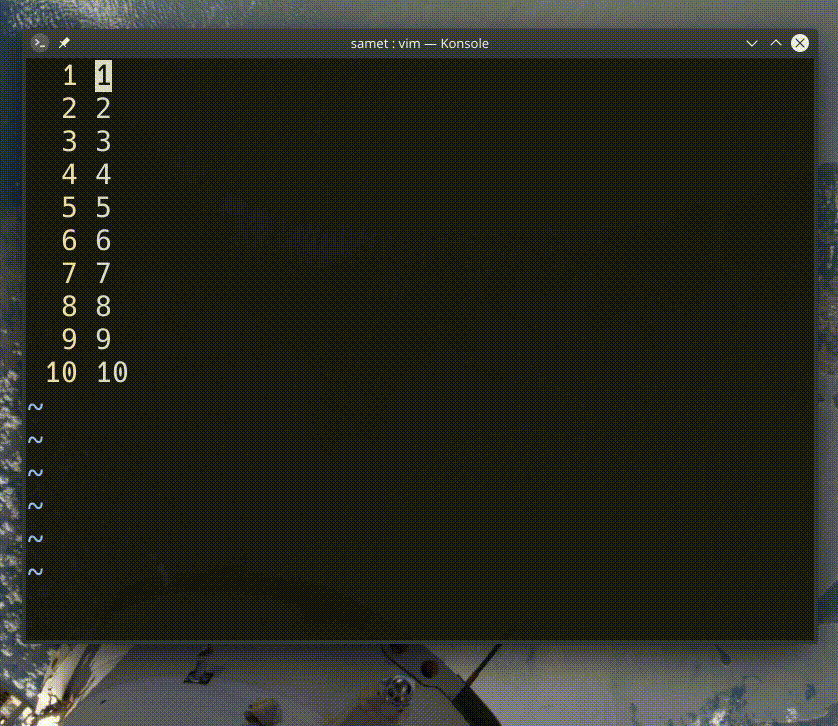

## `qaxi<C-r>=2*<C-r>"<Enter><Esc>jq`

- `qaxi` ― `a` için makro kaydı başlatır ve imlecin üzerindeki karakteri siler
- `<C-r>=` ― ifade (expression) yazmacı için girdi satırı açar
- `2*<C-r>"` ― matematiksel ifade yazılır, `<C-r>"` son kopyalanan/silinen değeri getirir 
- `<Enter><ESC>jq` ― ifade tamamlanır, girdi modundan çıkılır ve bir alt satıra geçilerek makro kaydı durdurulur
- `norm @a` ― görsel modda seçili olan tüm satırlar için `a` makrosunu çalıştırır
