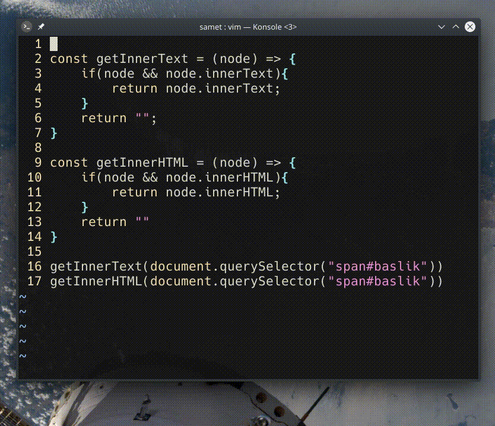

## `gn`

Son yapılan arama işlemi için eşleşen değerlere görsel modda atlama yaparak _bul-değiştir_ işlemlerini kolaylaştırır. Önceki eşleşmeyi seçmek için `gN` komutu verilmelidir.

Değişiklik işlemini hızlıca yapmak için şu kısayollar kullanılabilir:
- `n` ― sonraki eşleşmeye atlar
- `N` ― önceki eşleşmeye atlar
- `.` ― son uygulanan komutu tekrar eder

`:help gn`

