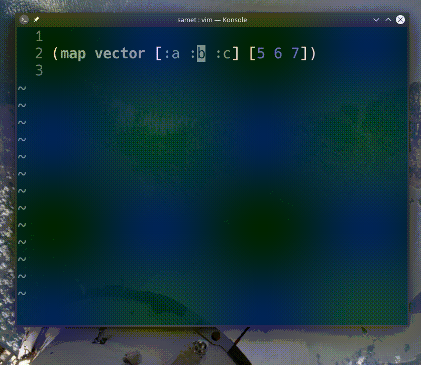

## `vi[`, `va[`, `vi(`, `va(`

Belirtilen parentez arasındaki değerleri seçer. `v` komutu görsel mod ile seçme işlemi yaparken, `i[`, yalnızca parentez içeriğini seçerken, `a[` içeriği parentezle birlikte seçer. Bu **i**nside ve **a**ll kelimelerinden hatırlanabilir.
