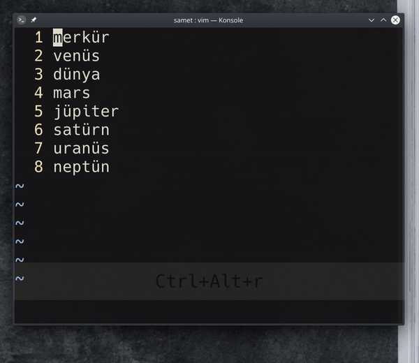

## `<C-v>GItext<esc><enter>`

Birden fazla satırda değişiklik yapmak için görsel blok modunu kullanabiliriz. `<C-v>` ile görsel blok modunu açtıktan sonra imleç ile değişiklik yapmak istediğimiz satırları seçip `I` komutunu göndererek girdi moduna geçiş yapıyoruz. Bu işlem bizi imleci bloğumuzun başlangıç satırına atıyor. Yaptığımız değişiklikten sonra `<esc>` ile görsel moddan çıkıyoruz. Bu noktada  `<enter>` tuşuna basarak yaptığımız değişiklikleri görsel blok moduyla seçtiğimiz tüm satırlar için uygulayabiliriz. 
