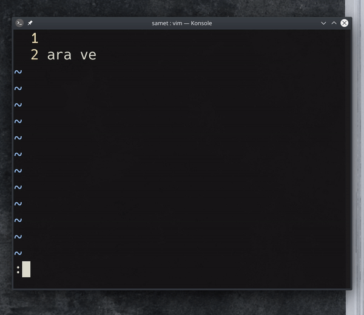

## `s/ara ve/& degistir/`, `s/ara ve/\0 degistir/`

Arama ve değiştirme işlemlerinde  yeni değeri girerken, & veya \0 karakterleri arama patterninde eşleşen değerleri getirir. Böylece arama ve değiştir işlemlerini daha efektif kullanabilirsiniz.
