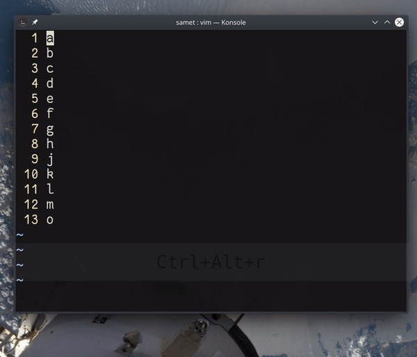

## `:1,5d`, `:.,$j`, `:%j`

Komut satırında aralıklar kullanılarak mevcut dosyada düzenleme işlemleri yapılabilir. 

Aralık verilirken başlangıç ve bitiş noktaları belirlenir. Bunlar satır sayıları, imleç satır (mevcut satır), tüm satırlar ve satır sonu olarak verilebilir. Başlangıç ve bitiş noktaları, `+4` ile 4 satır sonrası veya `-4` ile 4 satır öncesi belirlenebilir. 

### Örnekler 

| Aralık | Açıklama | Örnek |
| -------- | -------- | -------- |
| `.`     | Mevcut satır     | `:.d` - Mevcut satırı sil     |
| `$`     | Son satır     | `:$d` - Son satırı sil     |
| `$-4`     | Son satırdan önceki 4. satır     | `:$-4y` - Son satırdan önceki 4. satırı kopyala     |
| `2,6`     | 2. ve 6. satır aralığı     | `:2,6d` - 2. satırdan 6. satıra kadar sil     |
| `.,9`     | Mevcut satır ve 9. satır     | `:.,9d` - Mevcut satırdan 9. satıra kadar sil    |
| `.,.+4`     | Mevcut satır ve sonraki 4 satır      | `:.,.+4d` - Mevcut satır ve sonraki 4 satıra kadar sil |
| `.,$`     | Mevcut satır ve son satır      | `:.,$j` - Mevcut satırdan son satıra kadar olan satırları birleştir |
| `%`     | Tüm satırlar      | `:%j` - Tüm satırları birleştir |
| `%`     | Tüm satırlar      | `:%s/merhaba/güle güle/` - Tüm satırlardaki `merhaba` değerini `güle güle` olarak değiştir |
