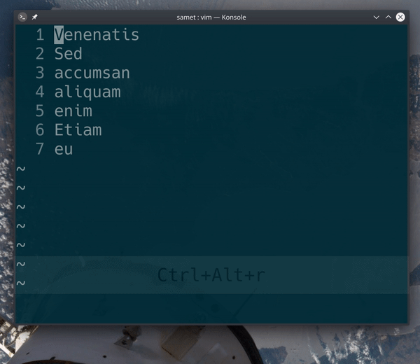

## `:/a/,/b/d`

Satır aralıkları arama işleviyle beraber kullanılabilir. Örnek komutta `/a/` ve `/b/` aralıkları bulunuyor ve `d` işlemiyle bu aralık için silme komutu veriliyor. Komut, dosya içinde bulunan ilk `a` karakterinden sonra gelen `b` karakterine kadar silme işlemi uyguluyor.

Örnek olarak `:/lorem/,$ s/d/c` komutunu inceleyelim. Aralık olarak dosyada `lorem` kelimesinin bulunduğu ilk satır ve dosya sonunu ifade eden `$` deyimi kullanılmış. İşlem olarak ise bu aralıkta yer alan tüm `d` karakterleri `c` karakteri olarak değiştirilmiş. 

Daha fazla bilgi için:

[vimturkce: satır aralıklarının kullanımı](/gifs/61_satir-araliklari)

`:help ranges`
