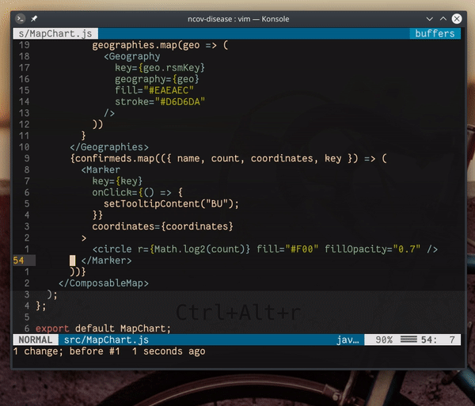

## `*`, `#`

Bu komutlar, imlecin altında bulunan kelimeyi dosya içinde arar.

- `#` ― imlecin altında bulunan kelimeyi dosya içinde imleçten önce arar.
- `*` ― imlecin altında bulunan kelimeyi dosya içinde imleçten sonra arar.

`:h *`, `:h #`
