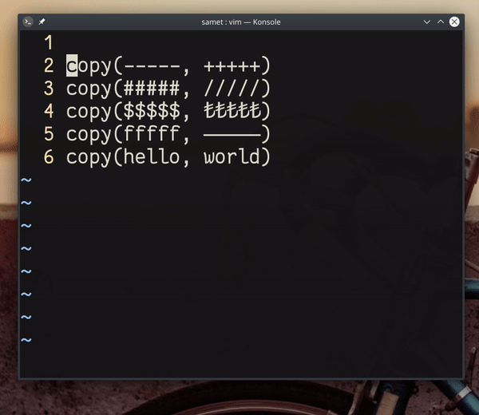

## `qqwldt,wvt)p%p<Enter>q`

Üstteki örnek komut, görselde bulunan kod örneğindeki fonksiyon parametlerinin yerlerini değiştiren (swap) bir işleve sahiptir. Komut içerisinde, başta ve sonda bulunan makro kayıt tuşları (`q`) örnekteki birden fazla fonksiyon çağrısını güncellemek için kullanılmıştır. 

#### komut açıklamaları

- `qq` ― `q` karakteri için makro kaydı başlatır
- `wl` ― imleci bir kelime (örnekteki _copy_ kelimesi) ileri ve bir karakter sağa atlatır 
- `dt,` ― imlecin konumundan sonraki `,` karakterinin yanına kadar siler
- `w` ― bir kelime ileri atlar
- `vt)p` ― imlecin konumundan sonra gelen `)` karakterine kadar görsel mod ile seçer ve sonra silinen değeri (bkz. `dt,`) - yapıştırır
- `%p` ― imlecin üstünde veya yanında bulunan parantezin çiftine (_aç/kapa_) atlama yapar
- `<Enter>q` ― alt satıra inerek makro kaydını durdurur.

#### değerlendirme

`vt)p` komutunu kullanmamızın en büyük sebebi, panodaki değeri (son silinen değer, bkz: `dt,`) yapıştırırken aynı zamanda panoya imleç altında bulunan değeri panoya alabiliyor olmamızdır. Değiştirme (swap) işlemini yaparken metnin taşınması/depolanması  yerine bu yöntem daha kullanışlıdır. 

Son aşamada kullanılan `<Enter>` komutu yerine 2 tuş kullanılarak `j^` kombinasyonu da verilebilir. `<Enter>` kullanmanın avantajı, normal moddayken basıldığında bir alt satırın başına atlamasıdır. Çoklu satır atlamak istediğimizde `4<Enter>` kombinasyonunu kullanarak, imlecin bulunduğu satırdan 4 satır aşağıdaki satırın başına daha kolay atlama yapabiliriz.

Pratik yapmak için [VimGolf: Bad Copy Syntax](http://www.vimgolf.com/challenges/5d3122ace2e18c0006b8bc4d) problemini çözmeye çalışabilirsin.
