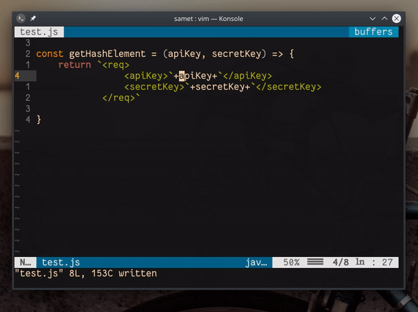

## `dw"_diti${}<ESC>p`

#### komut açıklamaları

- `dw` ― imlecin önündeki kelimeyi siler
- `"_dit` ― imlecin üzerinde bulunduğu tag nesnesinin (örnekte *apiKey*) içeriğini siler ve silinen değeri `"_` (blackhole) yazmacına taşır 
- `i${}<ESC>` ― girdi moduna girer ve `${}` karakterlerini yazar ve normal moda döner
- `p` ― panodaki son değeri (`dw` işleminde silinen değeri) vim panosuna yapıştırır

#### değerlendirme

Vim'de `c`, `d` veya `x` gibi silme, düzenleme ve kesme fonksiyonlarıyla silinen her değer, Vim'in panosuna kopyalanır. Eğer 2. aşamada yalnızca `dit` komutunu kullansaydık, 1. aşamada, etiketler arasında kullandığımız değer yeni değerin üzerinde yazılmasıyla birlikte kaybolacaktı. Bu yüzden ikinci aşamada silinen değeri kara delik yazmacına (blackhole register) yazdırdık. Bu yazmaca yazdırılan her değer, hiçbir panoda tutulmazlar.

*Yazmaçların kullanımıyla ilgili örnekler eklendikten sonra bu açıklama düzenlenecek ve genişletilecektir.*

`:help reg`
