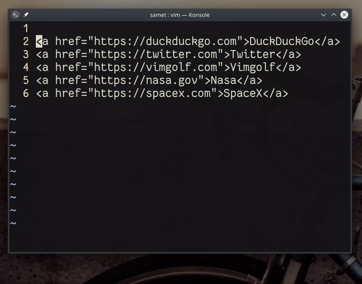
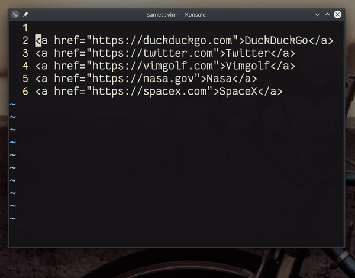

## `yt":%s/<C-R>"\(.*\)">\(.*\)<\/a>/[\2](\1)/g`

Bu örnekte HTML `<a href="...">` etiketiyle tanımlanmış birden fazla bağlantıyı markdown bağlantısına çevireceğiz. İlk yöntem olarak ara/değiştir yönteminde kullanılan komutları inceleyelim.

#### komut açıklamaları

- `yt"` ― imlecin bulunduğu konumdan sonraki `"` karakterin yanına kadar kopyalar, burada amaç ara/değiştir satırında `<a href=` ifadesini panodan almak için kopyalamaktır
- `:%s/<C-R>"` ― değiştirme işlemi için komut satırı açılır, `%` karakteri tüm satırları ifade eder, `<C-R>"` komutu `"` panosundaki değeri (son kopyalanan değer) komut satırına yapıştırır
- `\(.*\)">\(.*\)<\/a>/` ― bu ifade, `.*` regex değerine uyan değerleri yakalar ve değiştirme komutunda `\1`, `\2` kısayollarıyla tekrar kullanılabilir
- `[\2](\1)/g` ― arama komutunda yakalanan değerleri markdown formatına uygun olarak yazdırır 

---

## `qqdi"A()<ESC>P^ditf>a[]<ESC>P%d0qjVG:norm @q`

Farklı bir çözüm yöntemi olarak, atlamaları (jump) ve panoyu efektik kullanabiliriz.

#### komut açıklamaları

- `qq` ― `q` karakteri için makro kaydı başlatır
- `di"` ― imleç satırında bulunan `""` tırnakları içindeki değeri siler
- `A()<ESC>P` ― satır sonuna atlayarak girdi moduna geçiş yapar, `()` karakterlerini ekrana basar, normal moda döner bir imleç öncesinde panodaki son değeri (son silinen değeri) yapıştırır
- `^dit` ― satır başına (`^`) atlar ve imleç satırında bulunan etiketin (``) içeriğini siler (`dit ― delete-inside-tag`) 
- `f>a[]<ESC>P` ― imleçten sonraki `>` karakterine atlar, imleç sonraki karakter üzerinde girdi moduna geçiş yapar ve `[]` karakterlerini yazar, girdi modundan çıkar, son silinen değeri (etiketin içindeki değer) imleç öncesine yapıştırır
- `%d0q` ― imleç üzerinde/yanında bulunan parantezin eş-parentezine atlama yapar, imleç konumundan satır başına kadar siler ve `q` karakter için yapılan makro kaydını durdurur
- `jVG` ― bir alt satıra (`j`) iner, görsel-blok moduna (`V`) geçer ve son satıra (`G`) atlar
- `:norm @q` ― bir önceki komutta seçilen tüm satırlarda  `q` makrosunu çalıştırır

---

## `qqdi"yitS[<C-R>0](<C-R>-)<ESC>^qjVG:norm @q`

Daha sade bir çözüm olarak, yazmaçlar kullanılabilir. Bu yöntemde, silme ve kopyalama işlemiyle bağlantı adı ve adresini farklı panolara kaydediyor ve markdown bağlantısını oluştururken bu panodaki değerleri kullanıyoruz.

- `qq` ― `q` karakteri için makro kaydı başlatır
- `di"` ― imleç satırında bulunan `""` tırnakları içindeki değeri siler ― bu değer vim tarafından `-` yazmacına/panosuna (small-register) yazdırılır 
- `yit` ― imleç satırında bulunan etiketin (``) içeriğini kopyalar ― bu değer vim tarafından `0` yazmacına/panosuna (daima son kopyalanan değeri tutar) yazdırılır
- `S` ― imleç satırının içeriğini temizler ve satır başında girdi moduna geçer
- `[<C-R>0]` ― girdi modunda `[` karakteri yazılır, girdi modundayken `<C-R>` komutu (`ctrl+r`) herhangi bir panodan değer alabilmemiz için tek seferlik bir komut girmemize izin verir, `0` panosundaki değer (bağlantı adı) kullanılır
- `(<C-R>-)` ― bir önceki komuta benzer olarak, bu komutta da `-` panosundaki değer (bağlantı adresi) kullanılır
- `^q` ― imleç satır başına atlama yapar ve `q` karakteri için yapılan makro kaydını durdurur
- `jVG` ― bir alt satıra (`j`) iner, görsel-blok moduna (`V`) geçer ve son satıra (`G`) atlar
- `:norm @q` ― bir önceki komutta seçilen tüm satırlarda  `q` makrosunu çalıştırır
