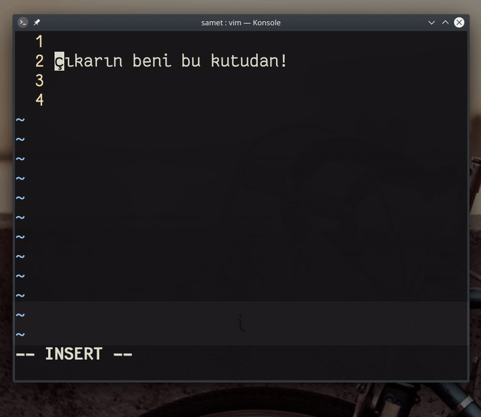

## `i<C-k>vv  <C-o>$  <C-k>vv<ESC>Y2PVr<C-k>hh2j.`

Bu alıştırmada, örnek bir yazıyı kutu içine alıyoruz. Alıştırmayı iki aşamada inceleyeceğiz. Birincisi yazıyı kutu alırken kullandığımız komutlara bakacağız, ikinci olarak Vim'in özel karakterler yazmamızı sağlayan `digraph` özelliğine bakacağız.

#### komut açıklaması

- `i<C-k>vv  ` ― girdi moduna geçiş yapıyoruz ve `CTRL+k` kombinasyonu göndererek bir *digraph* karakter girmek için girdi (input) açar, `vv` değerini girerek `│` boru karakterini yazar ve iki boşluk karakteri yazar
- `<C-o>$  ` ― `CTRL+O` kombinasyonuyla girdi modundayken tek komutluk bir değer gönderilebilir, `$` ile satır sonuna atlar ve iki boşluk bırakır
- `<C-k>vv<ESC>` ― ilk komutta yapılan işlemin tekrarıdır,  `│` karakterini yazının sonuna ekler ve girdi modundan çıkar
- `Y2P` ― imlecin bulunduğu satırın tümünü kopyalar (`Y`) ve imleçten önceki konuma 2 defa (`2P`) yapıştırır 
- `Vr<C-k>hh` ― görsel blok moduna geçer ve imleç altında seçili olan tüm karakterleri `─` çizgi karakteri `<C-k>hh` ile değiştirir `r`
- `2j.` ― iki satır aşağı iner ve bir önceki komutu tekrar ederek satırdaki tüm karakterleri `―` çizgi karakteri ile değiştirir


#### digraph karakterlerin kullanımı

Yukarıdaki açıklamalar yazıyı kutu içine alacaktır, fakat kutunun köşe karakterleri için farklı *digraph* karakterler kullanmamız gerekir. *digraph* karakterler, Vim'de kısayollarla yazabileceğimiz bazı özel karakterleri ifade eder. Bu karakterler `:dig` komutuyla görüntüleyebiliriz. Aşağıda örnek bir çıktı bulabilirsiniz.

Girdi veya görsel moddayken `<C-k>` kombinasyonu (`CTRL+k`) gönderdiğimizde Vim bizden girmemiz için iki karakter beklemektedir. Tabloda, *karakter kısayolu*, *karakter* ve *karakterin numarası* bulunur. `<C-k>` kombinasyonu sonrasında bu karakter kısayolunu kullanırsak bu tablodaki özel karakterleri yazdırabiliriz.

```
:dig
vv │  9474   VV ┃  9475   3- ┄  9476   3_ ┅  9477   3! ┆  9478   3/ ┇  9479
4- ┈  9480   4_ ┉  9481   4! ┊  9482   4/ ┋  9483   dr ┌  9484   dR ┍  9485
Dr ┎  9486   DR ┏  9487   dl ┐  9488   dL ┑  9489   Dl ┒  9490   LD ┓  9491
ur └  9492   uR ┕  9493   Ur ┖  9494   UR ┗  9495   ul ┘  9496   uL ┙  9497
Ul ┚  9498   UL ┛  9499   vr ├  9500   vR ┝  9501   Vr ┠  9504   VR ┣  9507
vl ┤  9508   vL ┥  9509   Vl ┨  9512   VL ┫  9515   dh ┬  9516   dH ┯  9519
Dh ┰  9520   DH ┳  9523   uh ┴  9524   uH ┷  9527   Uh ┸  9528   UH ┻  9531
vh ┼  9532   vH ┿  9535   Vh ╂  9538   VH ╋  9547   FD ╱  9585   BD ╲  9586
-- More --
```

Örneğin `<C-k>DH` komutu bize `┳` karakterini yazdıracaktır. Yazıyı kutu içine alırken aşağıdaki kısayolları kullandık.

- **dl** ― `┐`
- **dr** ― `┌`
- **ul** ― `┘`
- **ur** ― `└`


#### komutun değerlendirmesi

Bu örnekte kullandığımız komutlarda, pratik olmak  açısından önemli üç nokta bulunuyor.

Bunlardan biri `<C-o>` komutu. Girdi modundayken bu komutu kullandığımızda, normal mod için tek bir komut gönderebiliyoruz. Bu komutu verdikten sonra otomatik olarak tekrar girdi moduna geçiyor. Bunu kullanmasaydık, bu örnekte satır sonuna atlarken `<ESC>$i` veya `<ESC>A` komutunu vererek satır sonuna atlayabilirdik. Elbette girdi modundan hiç çıkmadan `<End>` tuşuyla da bu atlamayı sağlayabilirdik, fakat buradaki amaç Vim'i öğrenmek olduğu için buna değinmiyorum bile. Yoksa fare ile satır sonuna da tıklayabiliriz :)

Bir diğer nokta karakterleri toplu olarak değiştirdiğimiz (`Vr`) (replace) komutu. Normal modda, `r` komutunu gönderdikten sonra yeni bir karakter girerek imlecin üzerinde bulunduğu karakteri değiştirebiliriz. Görsel veya görsel blog modunda imleç ile seçtiğimiz karakterlerin tümünü değiştirmek istiyorsak, seçim sonrasında `r` komutunu verebilir ve yeni bir karakter girebiliriz; sonuç olarak seçili olan tüm karakterleri tek bir karakterle değiştirmiş oluruz. Bu örnekte de bu yöntemi kullanarak kutunun alt ve üst çizgilerini oluşturduk. Her karakteri tek tek yazmak yerine satırda görsel blok modunu (`V`) açtık `r<C-k>hh` komutu ile seçili olan tüm karakterleri `─` çizgi karakteri ile değiştirdik. Böylece satırın uzunluğu kadar üst ve alt çizgi elde etmiş olduk.

Son nokta, satırı çoğlatmak için kullandığımız `Y2P` komutu. Standart olarak kopyaladığımız bir satırı (`Y`) yapıştırdığımızda (`p`) Vim imlecin bulunduğu satırdan sonraki satıra yapıştırır. Buradaki `P` komutu, panodaki değeri bir üst satıra yapıştıracak ve başında `2` değeri bulunduğu için imleç satırından önce değeri 2 defa yapıştıracaktır. İmleç öncesine yapıştırmamızın sebebi, sonraki işlemi yapmak için birinci satırdan başlamaktır. Çünkü imleç, yapıştırma işlemi sonrasında yapıştırılan değerin en başına atlama yapar. Bu küçük bir detaydır, fakat pratiklik kazanmak için farkında olunması gereken bir noktadır.

`:help ctrl-o`
`:help dig[raphs]`
