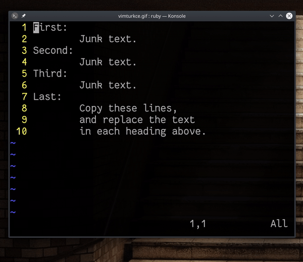

## `8,10y:g/J/norm V"0P`

Örnekte bizden `Last` başlığı altındaki yazıyı diğer başlıklar altına da taşımamız istenmektedir.

#### komut açıklama

- `8,10y` ― 8. ve 10. satır aralığını kopyala (*yank*)
- `:g/J/norm V"0P` ― `J` karakteri için `[g]lobal` arama yap ve eşleşen satırlarda görsel blok modunu açarak `"0` yazmacındaki değeri imleç öncesine yapıştır

#### komut değerlendirmesi

Komutu iki parçaya ayırabiliriz.

Birinci parçada `Last` başlığı altındaki satırları kopyalıyoruz. Bizden istenileni gerçekleştirmek için `J` karakteri üzerinden bir işlem yapabiliriz. Bunun için `:g/J` komutu ile `J` karakterini içeren tüm satırlarıı seçiyoruz. Buradaki `g`, `global` komutunun bir kısayolu. `:g/J` komutuyla sağlanan eşleşmelerde değişiklikler yapmak için global komutuna ikinci bir parametre vermek gerekiyor. Burada `:g/J/d` komutu verirsek, Vim'e *`J` karakterini içeren tüm satırları sil* demiş oluruz. Burada yapmak istediğimiz daha komplike bir işlem olduğu için `norm` komutu ile eşleşen satırlar için normal mod komutlarını simüle ediyoruz.

İkinci parça olarak `V"0P` komutunu ele alabiliriz öyleyse. Burada eşleşen tüm satırlar için görsel blok modunu açıyor ve `"0` yazmacındaki değeri yapıştırıyoruz. Görsel blok modunu açmamızın sebebi, satırı silmekle uğraşmak istemeyişimizdir. Çünkü `dd` komutu yerine `V` komutunu kullanmak daha pratik olacaktır. Bu komutla ilgili ikinci bir nokta olarak değeri neden `"0` yazmacından çağırdığımızı düşünebiliriz. Yalnızca `VP` komutunu kullanırsak, birinci eşleşme için değişiklik yapıldıktan sonra Vim üzerine yazdırılan değeri standart olarak kullanılan `""` yazmacına taşıyacaktır. Dolayısıyla ikinci eşleşmede alacağımız değer, ilk başta kopyalanan satır aralığı değil, birinci eşleşmede değiştirilen değerin içeriği olacaktır. Bunu yaşamamak için `"0` değeri kullanıldı.

`:help register`
`:help global`
