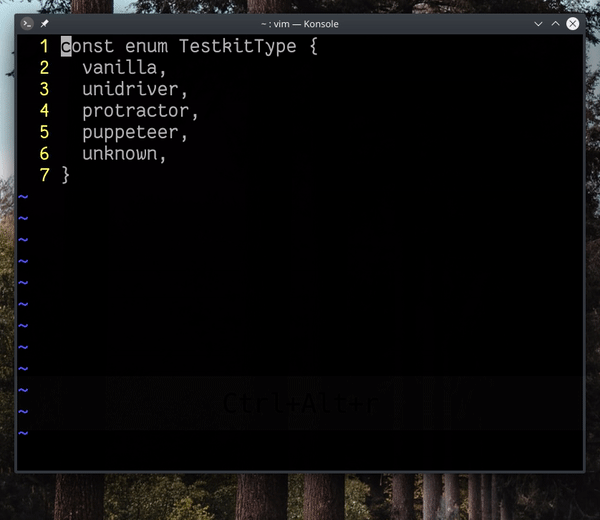

Bu alıştırmada bir obje tanımlamasında anahtar değerleri kopyalanarak değerler belirlenecek, fakat değerler büyük harflerle tanımlanacaktır.

## `qq+ywea = '<C-R>"'<ESC>vBUq4@q`

İlk yöntemde makroları ve yazmaçları kullanabiliriz.

#### komut açıklaması
- `qq` ― `q` karakteri için makro kaydı başlatır
- `+` ― bir alt satırın başlangıç karakterine atlar, benzer şekilde `<Enter>` tuşu da kullanılabilir
- `ywe` ― imleç önündeki kelimeyi kopyalar, kelime sonuna atlar
- `a = '<CR>"'` ― imleç karakterinden sonraki karakterde girdi moduna geçer, ` = '` değerini yazdırılır, `<CR>"` kombinasyonu (`CTRL+R ve "`)  `"` yazmacındaki (`isimsiz yazmaç`) değeri ekrana basar
- `<ESC>vBU` ― girdi modundan çıkılır, görsel mod (`v`) ile bir önceki kelime seçilerek (`B`) karakter büyütme (uppercase, `U`) komutu verilir
- `q4@q` ― makro kaydı durdurulur ve sonraki 4 satır için `q` makrosu çalıştırılır

#### komut değerlendirmesi

Birden fazla satır için işlem yapılacağından dolayı makrolar kullanmak mantıklı bir yaklaşımdır. Önemli noktalardan biri makro kaydını dosyanın ikinci satırında değil, birinci satırından başlatmış olmaktır. Çünkü en sonda diğer satırlar için makro çalıştırılacağından, kayıt esnasında alt satıra yapılan hareket de (`+`) kaydedilmelidir. 

Diğer bir nokta isimsiz yazmacın (`""`) kullanımıdır. Girdi modundayken `C-R` (veya `CTRL-R`) kombinasyonu ile yazmaçlardaki değerleri ekrana basabiliriz. Bunu kullanımındaki incelik, normal moda geçiş yaparak panodaki değeri yapıştırma külfetinden kurtulmaktır. Bu örnekte bu işlemi pek külfet sayamayız, çünkü tekrar girdi moduna geçiş yapmıyoruz. Dolayısıyla ` = ''<ESC>P` komut dizisini kullanarak da bu işlemi yapabiliriz.

## `+5:s/\w\+/& = '\U&'`

Farklı bir yöntem olarak *ara ve değiştir* işlemini kullanabiliriz.

#### komut açıklaması

- `+` ― bir alt satırın başlangıç karakterine atlar
- `5:s/` ― arama satırını imleç satırı ve sonraki 5 satır aralığı için açar (`.,.+4`)
- `\w\+` ― bir önceki komutta belirlenen satır aralığındaki kelimeleri eşleştirir
- `& = '\U&'` ― eşleşen kelimeleri (`&`) ve çıktıyı düzenler, eşleşen kelimerin karakterlerini büyütmek (uppercaase) için `\U` karakterini kullanır

#### komut değerlendirmesi

İnceleyeceğimiz birinci nokta komut satırını açmadan önce bir sayı belirtilmesidir. Eğer sayı belirtmeden komut satırını açarsak, yapacağımız ara-değiştir işleminde kullanacağımız `\w\+` düzenli ifadesi tüm satırlarda eşleşen değerler için çalışacaktır; fakat biz birinci satır için çalışmasını istemiyoruz. Alt satıra atlama hareketinden sonra `5:` kombinasyonunu göndererek, komut satırını yalnızca `.,.+4` satır aralığı için açıyoruz. Buradaki aralık ifadesinde bulunan `.`, imlecin bulunduğu satırı ve `.+4` imleçten sonraki 4. satır aralığında bulunan satırları kapsıyor.

İnceleyeceğimiz ikinci nokta ara-değiştir işleminde kullandığımız  `&` ve `\U&` değerleri. `&` karakteri, arama işleminde (`:s/`) eşleşen değerleri değiştirme işleminde tekrar kullanmamıza olanak sağlıyor. Böylece değiştirme işleminden ziyade eşleşen değerler için bir ekleme (*append*) işlemi yapmış oluyoruz. `\U&` karakteri ise eşleşen değerleri büyük karakterler ile çözerek değiştirme işlemini yapıyor.
