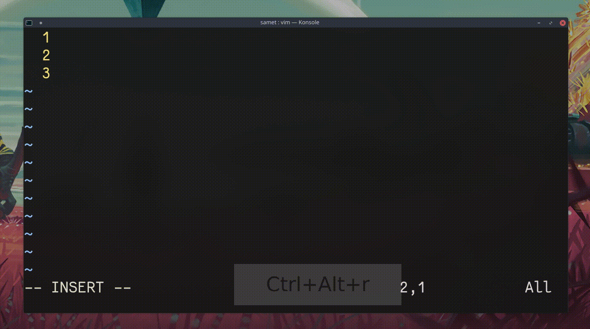

## `g+`, `g-`

Vim geri alma işlemlerinde (undo) değişiklik dallarını kullanır. Önceki bir değişikliğe geri dönüp yeni bir değişiklik yaptığınızda, mevcut değişiklik dalı kaybolmaz. Dallar arasında geçiş yapmak için `g+` ve `g-` veya `:earlier` ve `:later` komutları kullanılır.
